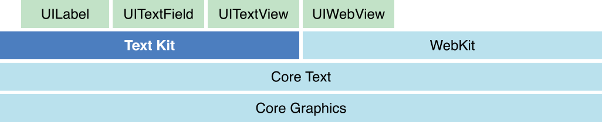
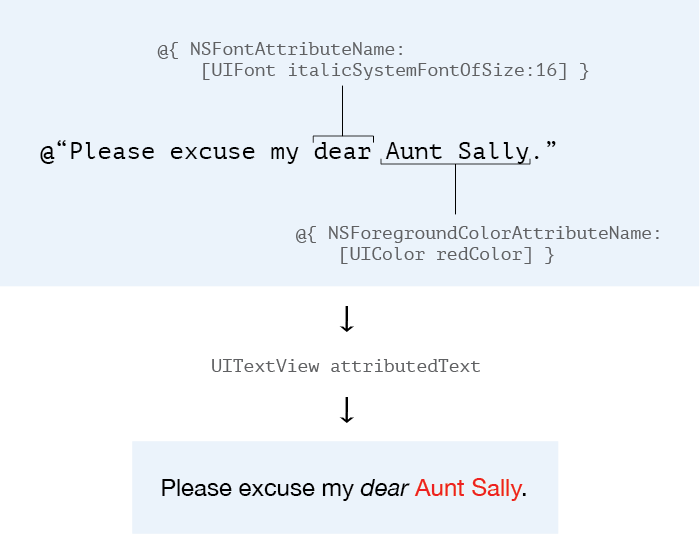
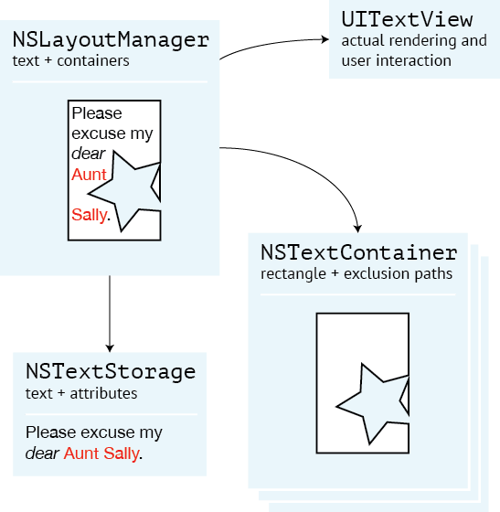

class: center, middle

# Text Kit & You

---


class: top

# Who?

--

### Oh hi! I'm Tim!

--

### misterfifths on GitHub

--

### iOS Engineer, Crush & Lovely

---


class: top

# What?

--

### Text Kit!

--

### Pages- or InDesign-level text layout engine

???
fully native -- no html/css (for better or worse), object-oriented, full cocoa experience
paragraph styles, character styles, ligatures, kerning; the works

--

### iOS 7+

???
improvements in 8, mainly regarding dynamic sizes that change as per the user's preferences

a simplification & modernization of existing OSX text stuff (cf. the NS prefix, not UI)

(it's reasonable to expect that apple was kicking this around internally for a while -- iOS pages
came out with iOS 5)

---


class: top

# Where?

--

.full-width-border[]

<small>*yanked from Apple's Text Kit guide*</small>

???
sits above coretext (big nasty c framework you don't want to think about. trust me.)

drives all the UIKit text views (UILabel, UITextField, UITextView)

it (believe it or not) was the case for a long while that webkit was responsible for most of the
text rendering in iOS, though its full power wasn't exposed, obviously, for performance reasons

kind of a vague thing, really... not an independent framework like, say, MapKit or CoreLocation.
has bits in Foundation and bits in UIKit.

---


class: top

# Why?

--

### Previously your options for complicated text were... 
???
and by 'complicated' here, I'm being generous. want to use multiple fonts in a text field or label? good luck.
want inline links? try overlaying a transparent button, or multiple views and a lot of math and manual line breaking.

--
web views
--
, shelling out $150 for a decent third-party library
--
, a brittle hodgepodge of multiple views and a lot of math
--
, or just crying.

---

class: middle, center

## Some people, when presented with a problem, think<br> "I know! I'll use <s>regular expressions</s> a web view!"

## Now they have two problems.


### <small>– apologies to ... well, no one seems to know who said this originally</small>

---


# How?

--

### `NSAttributedString`

???
Recall from that stack diagram earlier that TextKit powers UITextView, UILabel and UITextField
You may have been using TextKit without knowing it... it exposes parts of itself through these views
The most basic level of interaction (& also the most common) with TextKit is NSAttributedString

--

### = `NSString` + a set of `NSDictionary`s

???
nsstring + nsdictionary entries for specific character ranges
what lives in the dictionary? anything, really, but the only ones TextKit understands out of the box are the NS*AttributeNames

---

# Basics

--

## Some simple text formatting attributes:
### `NSFontAttributeName`<br>&nbsp;&nbsp;&nbsp;→ `UIFont`
--

### `NSForegroundColorAttributeName`<br>&nbsp;&nbsp;&nbsp;→ `UIColor`
--

### `NSShadowAttributeName`<br>&nbsp;&nbsp;&nbsp;→ `NSShadow`

---

.full-width[]

---

highlight-style: zenburn

```objc
NSDictionary *normalAttributes =
    @{ NSFontAttributeName: [UIFont systemFontOfSize:16],
       NSForegroundColorAttributeName: [UIColor brownColor] };

NSString *rawString = @"O brave new world, that has such people in't!";
*NSMutableAttributedString *string = 
*   [[NSMutableAttributedString alloc] initWithString:rawString
*                                          attributes:normalAttributes];


[string addAttribute:NSFontAttributeName
               value:[UIFont italicSystemFontOfSize:16]
               range:NSMakeRange(2, 5)];  // "brave"

[string addAttribute:NSForegroundColorAttributeName
               value:[UIColor redColor]
               range:NSMakeRange(8, 9)];  // "new world"


NSShadow *handsomeShadow = [[NSShadow alloc] init];
handsomeShadow.shadowOffset = CGSizeZero;
handsomeShadow.shadowBlurRadius = 5;

NSDictionary *suchPeopleAttributes =
    @{ NSForegroundColorAttributeName: [UIColor redColor],
       NSShadowAttributeName: handsomeShadow };

[string addAttributes:suchPeopleAttributes
                range:NSMakeRange(28, 11)];  // "such people"


self.dummyLabel.attributedText = string;
```

???
prep the default attrs
note that like NSString, there's a mutable version of attr strings
it needs to be mutable to mutate *any* of it... contents or attrs

---

highlight-style: zenburn

```objc
NSDictionary *normalAttributes =
    @{ NSFontAttributeName: [UIFont systemFontOfSize:16],
       NSForegroundColorAttributeName: [UIColor brownColor] };

NSString *rawString = @"O brave new world, that has such people in't!";
NSMutableAttributedString *string = 
    [[NSMutableAttributedString alloc] initWithString:rawString
                                           attributes:normalAttributes];


*[string addAttribute:NSFontAttributeName
*              value:[UIFont italicSystemFontOfSize:16]
*              range:NSMakeRange(2, 5)];  // "brave"

[string addAttribute:NSForegroundColorAttributeName
               value:[UIColor redColor]
               range:NSMakeRange(8, 9)];  // "new world"


NSShadow *handsomeShadow = [[NSShadow alloc] init];
handsomeShadow.shadowOffset = CGSizeZero;
handsomeShadow.shadowBlurRadius = 5;

NSDictionary *suchPeopleAttributes =
    @{ NSForegroundColorAttributeName: [UIColor redColor],
       NSShadowAttributeName: handsomeShadow };

[string addAttributes:suchPeopleAttributes
                range:NSMakeRange(28, 11)];  // "such people"


self.dummyLabel.attributedText = string;
```

???
so now we're going to go back and change the attrs over a given range.
note that the method is called "addAttribute...". if that attribute name is already applied to the given range, it is overwritten

and then we give call the "addAttributes..." method, which does the same thing as the other, just merges in a dictionary of attrs

---

highlight-style: zenburn

```objc
NSDictionary *normalAttributes =
    @{ NSFontAttributeName: [UIFont systemFontOfSize:16],
       NSForegroundColorAttributeName: [UIColor brownColor] };

NSString *rawString = @"O brave new world, that has such people in't!";
NSMutableAttributedString *string = 
    [[NSMutableAttributedString alloc] initWithString:rawString
                                           attributes:normalAttributes];


[string addAttribute:NSFontAttributeName
               value:[UIFont italicSystemFontOfSize:16]
               range:NSMakeRange(2, 5)];  // "brave"

[string addAttribute:NSForegroundColorAttributeName
               value:[UIColor redColor]
               range:NSMakeRange(8, 9)];  // "new world"


NSShadow *handsomeShadow = [[NSShadow alloc] init];
handsomeShadow.shadowOffset = CGSizeZero;
handsomeShadow.shadowBlurRadius = 5;

NSDictionary *suchPeopleAttributes =
    @{ NSForegroundColorAttributeName: [UIColor redColor],
       NSShadowAttributeName: handsomeShadow };

[string addAttributes:suchPeopleAttributes
                range:NSMakeRange(28, 11)];  // "such people"


*self.dummyLabel.attributedText = string;
```

???
and finally we throw all of that into the attributedText property of a label
note that when you assign attributedText, the basic properties on UILabel (/text view) cease to be honored -- color, font, alignment
you have to do those with attributes; it's all-in or all-out

---

name: demo
class: middle, center

# Demo

## 🎉


---


# Links

--

### `NSLinkAttributeName`<br>&nbsp;&nbsp;&nbsp;→ `NSURL`

--

### Essentially calls `-[UIApplication openURL:]`, but there is a method in `UITextViewDelegate` to intercept taps.

???
that latter thing allows for some really neat stuff -- essentially buttons in line with text that let you do whatever you want
this used to be a frequent technique from web views, but it's much cleaner this way

---

template: demo

---


# A Deeper Dive

--

## Dramatis Personae

### `NSAttributedString`

--

### `NSTextStorage`

--

### `NSLayoutManager`

--

### `NSTextContainer`

--

### then into UIKit – `UITextView`, `UITextField`, `UILabel`

---


# `NSTextStorage`

--

## Subclass of `NSMutableAttributedString`
## Essentially just adds notifications about edits, so interested parties can update themselves

---


# `NSLayoutManager`

--

## Manages layout calculations and drawing

--

## Ties together an `NSTextStorage` and a number of `NSTextContainer`s

---

# `NSTextContainer`

--

## Defines a region where the layout manager can render text

--

## At its core, just a rectangle. But can support arbitrary shapes via exclusion paths (more on tha tlater)

---

class: middle, center

## All together now

---

class: center

.full-height[]

???
note that a single NSTextStorage instance can span multiple text containers

---

# All together now

## And now we see how UIKit and Text Kit come together:
--

### `UITextView`, `UITextField`, `UILabel` all manage a single `NSTextContainer` and an `NSLayoutManager` (though only in `UITextView` are the guts exposed)
--

### The text container's dimensions are tied to that of the view
--

### Scrolling `UITextViews` essentially present an `NSTextContainer` of infinite height

---


# Opportunities

--

## Every layer of the stack opens up interesting possibilities...

---

# Opportunities

## `NSTextStorage`: string replacement, code highlighting

???
NSTextStorage is told about all edits to its content, and can inform the rest of the stack if those edits have caused a change in attributes. a good place for, say, string replacement or code highlighting.

--

## `NSLayoutManager`: customizing rendering, detailed queries about layout

???
NSLayoutManager is intense but can let you do some cool things like customize underline rendering or change the way hyphenation and word wrapping work. it also has a ton of methods for querying information about text, like "what particular lines of text fit into this container?" or "what is the frame of this particular character?"

--

## `NSTextContainer`: exclusion paths, flowing the same text across multiple containers

???
provides a width and height to the layout manager, but can be used to represent arbitrary shapes via exclusions paths (hold that thought)
a NSTextStorage can be presented across any number of NSTextContainers

---

template: demo

---

class: center, middle

# In the Wild
## 🍻

---


class: top, center

# <span style="font-size: 300px; font-family: PT Serif; border-bottom: transparent">Q&rsquo;s?</span>

--

### Tim Clem
### github.com/misterfifths/textkit-talk